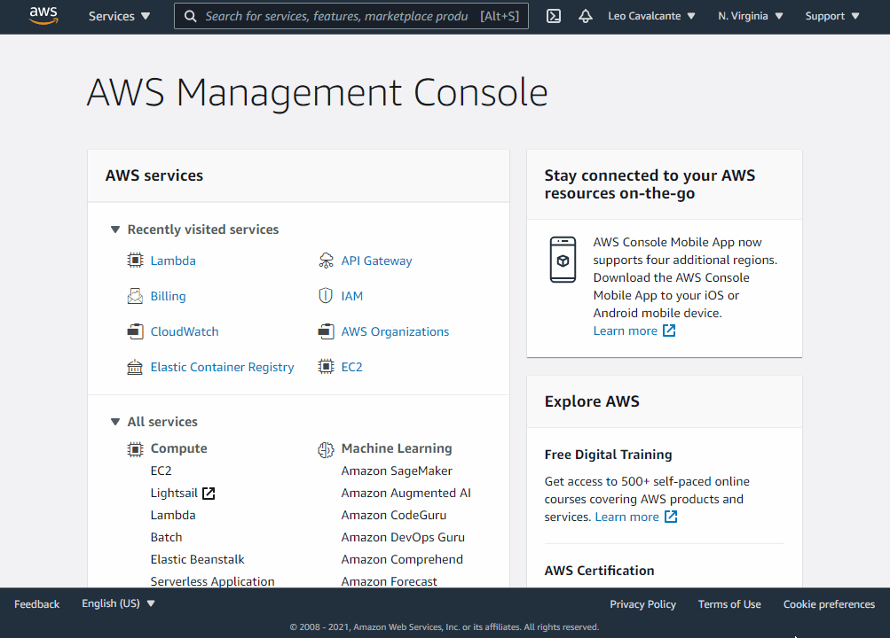

# λ Swoole Runtime for AWS Lambda

Run PHP Coroutines & Fibers as-a-Service on the AWS Lambda.

## Getting started

### Create your Lambda function

#### index.php
```php
<?php declare(strict_types=1);

use Swoole\Coroutine;

/**
 * It is already inside a Coroutine context (i.e.: Co\run)
 */
function main(array $context): string
{
    $channel = new Coroutine\Channel(2);
    $context['greet'] ??= 'World';

    Coroutine::create(static function() use ($context, $channel): void {
        Coroutine::sleep(1);
        $channel->push("{$context['greet']}!");
    });

    Coroutine::create(static function() use ($channel): void {
        Coroutine::sleep(0.5);
        $channel->push('Hello');
    });

    return implode(', ', [$channel->pop(), $channel->pop()]);
}
```
The `main(array $context)` function here **is not optional**, the runtime will make a call to a `main` function passing a `array` representing the context.
The return should be something scalar or a `JsonSerializable` object.

#### Dockerfile
```Dockerfile
FROM leocavalcante/aws-lambda-swoole-runtime
# The WORKDIR is already /var/task
COPY composer.* .
RUN composer install -o --prefer-dist --no-dev
# This split avoids a call to composer install on every change to a source-code file
COPY . .
```

### Testing locally

To test AWS Lambda functions based on Container images locally, Amazon provides the [AWS Lambda Runtime Interface Emulator (RIE)](https://docs.aws.amazon.com/lambda/latest/dg/images-test.html).

> It is a proxy for the Lambda Runtime API that allows you to locally test your Lambda function packaged as a container image. The emulator is a lightweight web server that converts HTTP requests into JSON events to pass to the Lambda function in the container image.

#### Build the image
```bash
docker build -t my-aws-lambda-function .
```
Also grab the `8080` port on the container, it will be where the emulator will bind to.

#### Run using the RIE as Entrypoint
```bash
docker run --rm -v "$(pwd)/aws-lambda-rie:/aws-lambda-rie" --entrypoint /aws-lambda-rie -p 9000:8080 my-aws-lambda-function
```

#### Make a POST request
```http request
POST http://localhost:9000/2015-03-31/functions/function/invocations
Content-Type: application/json

{"greet": "Swoole"}
```

Or:
```bash
curl -XPOST http://localhost:9000/2015-03-31/functions/function/invocations -d '{"greet": "Swoole"}'
```

You should be seeing:

```http reponse
HTTP/1.1 200 OK
Date: Fri, 19 Mar 2021 17:44:58 GMT
Content-Length: 16
Content-Type: text/plain; charset=utf-8

"Hello, Swoole!"
```

### Deploying to production

#### 1. Login to your ECR
```bash
aws ecr get-login-password --region us-east-1 | docker login --username AWS --password-stdin 884320951759.dkr.ecr.us-east-1.amazonaws.com
```
Don't forget to change region `us-east-1` and the AWS Account ID (`884320951759`).

> It assumes that you already have the [AWS Command Line Interface (`aws`)](https://aws.amazon.com/cli/) and it is [already configured (`aws configure`)](https://docs.aws.amazon.com/cli/latest/userguide/cli-configure-quickstart.html). **And yes, a Private ECR already created.**

⚠️ Also make sure that you will be using a Private ECR on the same Account that your Lambda function.

#### 2. Build and push your image
```bash
docker build -t 884320951759.dkr.ecr.us-east-1.amazonaws.com/lambda-swoole-runtime-example .
docker push 884320951759.dkr.ecr.us-east-1.amazonaws.com/lambda-swoole-runtime-example
```

#### 3. Your Swoole-powered AWS Lambda Container image is ready!

You can use the Web UI to create a **Function** based on it:



---

<center>&copy; MIT 2021-today</center>
